<!-- ✨ Animated Banner ✨ -->

 

<table align="center" border="0">
<tr>
<td width="38%" align="center" valign="middle">

<!-- 🪪 Swinging Lanyard ID Card (React Bits style, pure SVG) -->

</td>
<td width="62%" valign="middle">

### 💻 My Projects

| 🚀 Project | 💻 Tech |
|:---|:---:|
| [☕ Java CRUD Application](https://github.com/manojkumar-devep/your-repository) | `Java` `Spring Boot` `PostgreSQL` |

 

> 💚 *"Code. Learn. Build. Repeat."*

</td>
</tr>
</table>

 

### 📊 GitHub Stats & Graphs

  

  

<!-- 📈 Contribution Activity Graph -->

  

<!-- 🏆 Trophies (local animated SVG — always loads) -->

  

### 🐍 Watch the snake eat my contributions

  

### 📫 Let's Connect

  

  

*⭐️ Always learning, always building.* 💚

